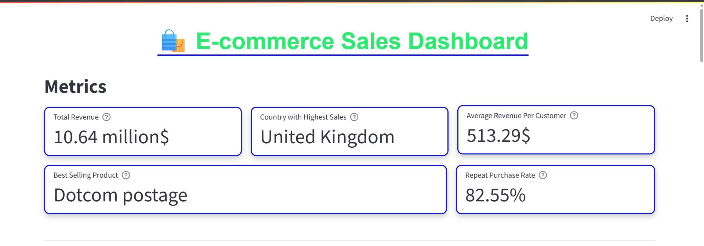
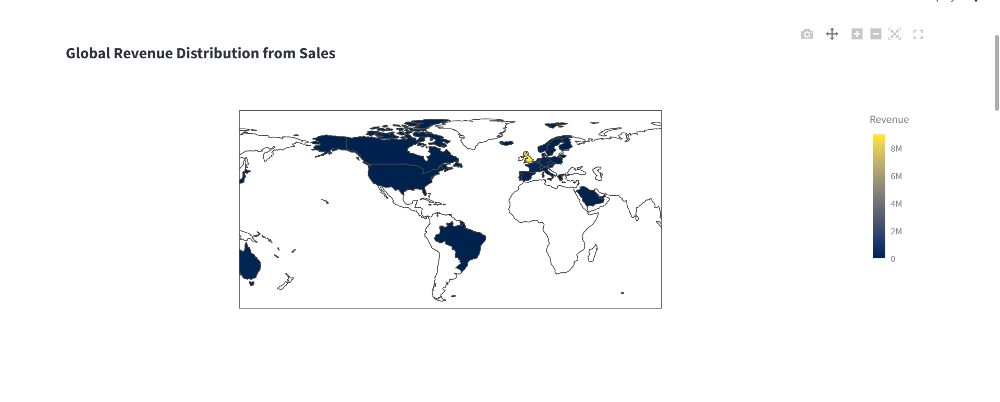
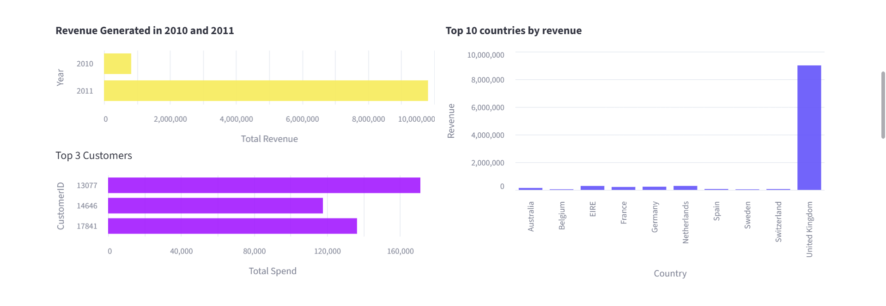
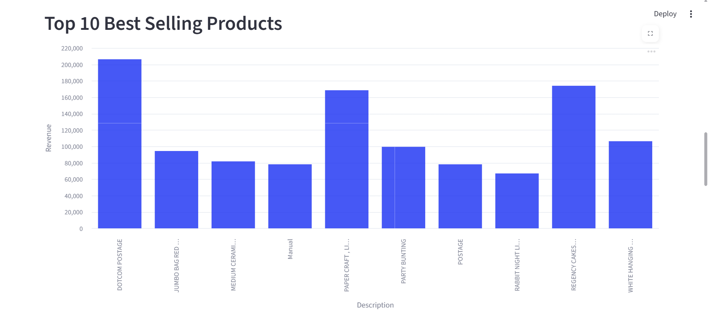
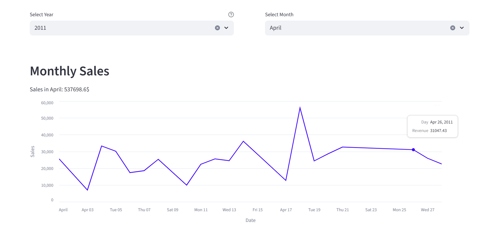
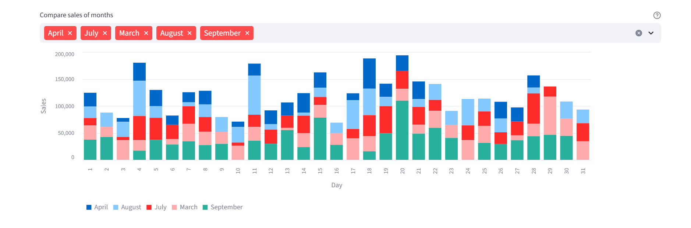

# E-commerce Sales Dashboard

**Overview**  
This is an interactive **E-commerce Sales Dashboard** built with **Streamlit** to analyze and visualize transactional sales data. The dashboard provides actionable insights into revenue trends, product performance, customer behavior, and geographic sales distribution, helping businesses make data-driven decisions.

---

## Key Features

### Key Performance Indicators (KPIs)
- **Total Revenue** – Overall revenue generated.  
- **Average Revenue per Customer** – Average spend per customer.  
- **Best Selling Product** – Product contributing most to revenue.  
- **Repeat Purchase Rate** – Percentage of customers making multiple purchases.  
- **Country with Highest Sales** – Top-performing country by revenue.  

**KPI Cards Example:**  

*This image represents KPI/metric cards like Total Revenue, Best Selling Product, Repeat Purchase Rate, etc.*

---

### Interactive Filters
- **Year Selector** – Filter data by year.  
- **Month Selector** – Filter data by a specific month within the selected year.  
- **Multi-Month Comparison** – Compare multiple months’ sales side by side.  

---

### Visualizations
- **Bar Charts** – Compare sales across months or products.   
- **Choropleth Maps** – Visualize revenue distribution across countries.  
- **Interactive Plotly Charts** – Hover-based insights for detailed exploration.  

**Graphs Example:** 

*This image represents various visualizations such as bar charts, line charts, and choropleth maps.*

---

## Technologies Used
- **Python 3.13**  
- **Streamlit** – Interactive web dashboard  
- **Pandas** – Data aggregation and manipulation  
- **Matplotlib & Seaborn** – Static charts  
- **Plotly Express** – Interactive charts  

---
